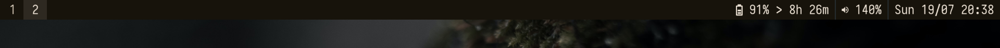

Very Simple status bar for wayland (mangowm) written in zig.
Program is not organized very well, only for personal use.

Uses the dwl ipc protocol

Supports:
- Workpaces (via dwl-ipc)
- Battery
- Volume (via libpulse)
- Time

dependencies:
- fcft
- pixman
- libwayland

Theme loading (~/.config/zsb/settings.zon) Check src/main.zig for fields
Default setting in the settings.zon

Build:

```
zig build -Doptimize=ReleaseSafe
````
